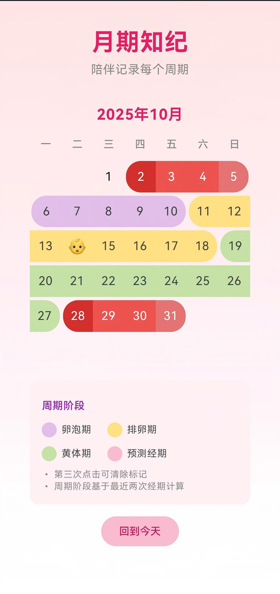

# PeriodAndroidApp

<div align="center">

**一款注重隐私的 Android 经期跟踪应用**

基于 Jetpack Compose 构建 | 完全离线 | Material Design 3

[](https://kotlinlang.org/)
[](https://developer.android.com/)
[](LICENSE)

</div>

## 📱 应用简介

PeriodAndroidApp 是一款完全离线的 Android 经期跟踪应用，专为注重隐私的用户设计。采用现代化的 Jetpack Compose 框架构建，提供智能周期分析、直观的日历界面和流畅的用户体验。所有数据本地存储，永不联网。

## ✨ 核心功能

### 🎯 交互体验
- 📅 **滑动切换月份** - 左右滑动流畅切换月份，支持快速回到今天
- 👆 **点击记录经期** - 点击开始日期，再点击结束日期，自动填充中间日期
- 🗑️ **第三次点击删除** - 点击已记录的日期可删除整个经期
- 📍 **今日标记** - 当前日期自动加黑加粗，易于识别

### 🔮 智能分析
- 📊 **周期自动计算** - 基于最近两次经期智能计算周期长度
- 🎯 **精准预测** - 自动预测下次经期、排卵期和排卵日
- 🌈 **四阶段可视化** - 卵泡期（紫）、排卵期（黄）、黄体期（绿）、经期（红/粉）
- 🔄 **连续显示** - 同一阶段的日期以连续色块形式展示，视觉效果更清晰

### 🔒 隐私安全
- 🚫 **零网络权限** - 无任何网络权限，数据永不离开设备
- 💾 **本地存储** - 使用 Room 数据库安全存储
- 🗑️ **随时删除** - 用户完全控制数据，可随时删除任何记录

## 📸 应用截图

> 

## 🎨 设计特色

### 日历视觉设计
- **周一开始** - 符合国际惯例，从周一开始排列
- **固定高度** - 日历固定 6 行显示，避免高度跳动
- **圆角矩形** - 单个日期显示为圆角矩形（16dp）
- **连续效果** - 同阶段连续日期：
  - 开始日期：左侧圆角
  - 中间日期：无圆角，左右无间距
  - 结束日期：右侧圆角
  
### 颜色系统
| 颜色 | 说明 | Hex Code |
|------|------|----------|
| 🔴 深红色 | 经期开始 | `#D32F2F` |
| 🔴 红色 | 经期中间 | `#EF5350` |
| 🩷 浅红色 | 经期结束 | `#E57373` |
| 🩷 浅粉红 | 预测经期 | `#F8BBD0` |
| 🟣 浅紫色 | 卵泡期 | `#E1BEE7` |
| 🟨 浅黄色 | 排卵期 | `#FFE082` |
| 🟢 浅绿色 | 黄体期 | `#C5E1A5` |
| 🟡 黄色 | 待确认开始 | `#FFF59D` |
| 👶 图标 | 排卵日 | - |

## 🚀 快速开始

### 环境要求
- Android Studio Hedgehog (2023.1.1) 或更高版本
- Android SDK 35
- JDK 11 或更高版本
- Gradle 8.11.1

### 构建步骤

1. **克隆仓库**
```bash
git clone https://github.com/liulc-tech-star/PeriodAndroidApp.git
cd PeriodAndroidApp
```

2. **配置环境变量**
```bash
# 设置 ANDROID_HOME 环境变量
export ANDROID_HOME=/path/to/your/Android/Sdk  # macOS/Linux
# 或
set ANDROID_HOME=C:\Users\YourName\AppData\Local\Android\Sdk  # Windows
```

3. **构建 APK**
```bash
# 使用 Gradle Wrapper 构建
./gradlew assembleDebug        # macOS/Linux
gradlew.bat assembleDebug      # Windows
```

4. **安装到设备**
```bash
# 连接 Android 设备或启动模拟器
adb install app/build/outputs/apk/debug/app-debug.apk
```

生成的 APK 位于：`app/build/outputs/apk/debug/app-debug.apk`

## 📖 使用指南

### 基本操作

#### 记录经期
1. **第一次点击** - 选择经期开始日期（黄色高亮）
2. **第二次点击** - 选择经期结束日期（自动填充中间日期为红色）
3. **第三次点击** - 点击已记录的任意日期，删除整个经期

#### 浏览日历
- **滑动切换** - 左右滑动切换月份
- **回到今天** - 点击底部"回到今天"按钮（800ms 平滑动画）
- **查看阶段** - 不同颜色代表不同生理阶段

### 周期阶段说明

| 阶段 | 天数 | 说明 |
|------|------|------|
| **卵泡期** | 经期结束 → 排卵期 | 卵泡发育阶段 |
| **排卵期** | 约 8 天 | 排卵日前后 3-4 天 |
| **排卵日** | 1 天 | 标记为 👶，预测经期前 14 天 |
| **黄体期** | 排卵期 → 下次经期 | 黄体形成阶段 |
| **预测经期** | 5-7 天 | 基于周期计算的预测值 |

## 🏗️ 技术架构

### 技术栈

| 类别 | 技术/版本 |
|------|----------|
| **语言** | Kotlin 100% |
| **UI 框架** | Jetpack Compose + Material 3 |
| **数据库** | Room Database 2.7.0 |
| **架构模式** | MVVM |
| **异步处理** | Kotlin Coroutines + Flow |
| **日期处理** | Java Time API (LocalDate) |
| **依赖注入** | 手动注入 |

### 构建配置

```kotlin
Android {
    compileSdk = 35
    minSdk = 26  // Android 8.0+
    targetSdk = 35
    
    kotlinOptions {
        jvmTarget = "1.8"
    }
    
    buildFeatures {
        compose = true
    }
}

Dependencies {
    Compose BOM = "2024.11.00"
    Room = "2.7.0-alpha11"
    Kotlin = "1.9.0"
}
```

```
PeriodAndroidApp/
├── app/
│   ├── src/main/
│   │   ├── java/com/example/period_app_01/
│   │   │   ├── MainActivity.kt           # 应用入口
│   │   │   ├── EnterDate.kt              # 主界面
│   │   │   ├── CalendarView.kt           # 日历组件
│   │   │   └── data/
│   │   │       ├── PeriodRecord.kt       # 数据模型
│   │   │       ├── PeriodRecordDao.kt    # DAO
│   │   │       ├── CycleCalculator.kt    # 周期计算
│   │   │       └── DatesDatabase.kt      # Room 数据库
│   │   ├── assets/
│   │   │   └── privacy.html              # 隐私政策
│   │   └── res/                          # 资源文件
│   └── build.gradle.kts
├── gradle/
│   └── libs.versions.toml                # 依赖版本管理
├── build.gradle.kts
└── settings.gradle.kts
```

## 数据库设计

### PeriodRecord 表

```kotlin
@Entity(tableName = "period_records")
data class PeriodRecord(
    @PrimaryKey(autoGenerate = true) val id: Int = 0,
    val date: LocalDate,              // 日期
    val recordType: Int,              // 0=待定, 1=开始, 2=中间, 3=结束
    val periodId: Long,               // 经期ID（同一周期共享）
    val createdAt: Long               // 创建时间戳
)
```

### 周期计算算法

```kotlin
// 1. 周期长度 = 最近两次经期开始日期的间隔
cycleLength = secondStartDate - firstStartDate

// 2. 预测下次经期 = 最近开始日期 + 周期长度
nextPeriod = lastStartDate + cycleLength

// 3. 排卵日 = 预测经期 - 14天（黄体期固定约14天）
ovulationDay = nextPeriod - 14

// 4. 排卵期 = 排卵日 ± 3-4天（共8天）
ovulationPhase = [ovulationDay-3, ovulationDay+4]

// 5. 卵泡期 = 经期结束 到 排卵期开始
follicularPhase = [periodEnd+1, ovulationPhase.start-1]

// 6. 黄体期 = 排卵期结束 到 下次经期前
lutealPhase = [ovulationPhase.end+1, nextPeriod-1]
```

## 🔐 隐私与安全

### 隐私承诺

✅ **零网络权限** - `AndroidManifest.xml` 无任何网络相关权限声明  
✅ **本地存储** - 所有数据仅存储在设备本地 Room 数据库  
✅ **用户控制** - 可随时删除任何经期记录或清除全部数据  
✅ **卸载清除** - 卸载应用即删除所有本地数据  
✅ **隐私协议** - 首次启动需用户同意隐私政策  
✅ **无广告追踪** - 不集成任何第三方 SDK 或广告服务  

### 权限说明

应用**不请求**任何危险权限，仅使用：
- ❌ 无网络权限
- ❌ 无定位权限
- ❌ 无相机权限
- ❌ 无通讯录权限

### 数据使用

- 经期记录仅用于本地周期计算和预测
- 所有计算均在设备本地完成
- 不收集、不上传、不共享任何个人数据
- 不进行任何形式的数据统计或分析

## 🎯 功能路线图

### ✅ 已完成
- [x] 日历式交互界面
- [x] 滑动切换月份（HorizontalPager）
- [x] 经期记录（点击开始/结束/删除）
- [x] 智能周期计算
- [x] 四阶段可视化（卵泡/排卵/黄体/经期）
- [x] 排卵日标记（👶 图标）
- [x] 下次经期预测
- [x] 多周期历史显示
- [x] 连续阶段色块显示
- [x] 圆角矩形设计（16dp）
- [x] 回到今天按钮
- [x] 今日加黑加粗标记
- [x] Material 3 UI
- [x] 周一开始日历
- [x] 固定 6 行日历高度
- [x] 隐私协议页面

### 🚧 计划中
- [ ] 症状记录（心情、体温、症状）
- [ ] 数据导出（CSV/PDF）
- [ ] 数据备份与恢复
- [ ] 提醒通知
- [ ] 主题切换（浅色/深色）
- [ ] 多语言支持
- [ ] 统计图表（周期趋势）
- [ ] 桌面小部件

## 🤝 贡献指南

欢迎提交 Issue 和 Pull Request！

### 开发流程

1. **Fork 本仓库**
2. **创建特性分支**
   ```bash
   git checkout -b feature/your-feature-name
   ```
3. **提交更改**
   ```bash
   git commit -m "✨ Add: your feature description"
   ```
4. **推送分支**
   ```bash
   git push origin feature/your-feature-name
   ```
5. **提交 Pull Request**

### 提交规范

使用 [Conventional Commits](https://www.conventionalcommits.org/) 规范：

- `✨ feat:` 新功能
- `🐛 fix:` 修复 Bug
- `📝 docs:` 文档更新
- `💄 style:` 代码格式调整
- `♻️ refactor:` 重构代码
- `⚡ perf:` 性能优化
- `✅ test:` 测试相关
- `🔧 chore:` 构建配置

### 代码规范

- 遵循 [Kotlin 官方编码规范](https://kotlinlang.org/docs/coding-conventions.html)
- 使用 Jetpack Compose 最佳实践
- 保持代码简洁可读，添加必要的中文注释
- 函数复杂度控制在 15 行以内
- 使用有意义的变量命名

## 📄 许可证

本项目采用 [MIT 许可证](LICENSE)。

```
MIT License

Copyright (c) 2025 liulc-tech-star

Permission is hereby granted, free of charge, to any person obtaining a copy
of this software and associated documentation files (the "Software"), to deal
in the Software without restriction, including without limitation the rights
to use, copy, modify, merge, publish, distribute, sublicense, and/or sell
copies of the Software, and to permit persons to whom the Software is
furnished to do so, subject to the following conditions:

The above copyright notice and this permission notice shall be included in all
copies or substantial portions of the Software.
```

## 👨‍💻 作者

**liulc-tech-star**

- GitHub: [@liulc-tech-star](https://github.com/liulc-tech-star)
- 项目地址: [PeriodAndroidApp](https://github.com/liulc-tech-star/PeriodAndroidApp)

## 🙏 致谢

感谢以下开源项目和技术：

- [Jetpack Compose](https://developer.android.com/jetpack/compose) - Android 现代声明式 UI 工具包
- [Room Database](https://developer.android.com/training/data-storage/room) - Android 持久化库
- [Material Design 3](https://m3.material.io/) - Google 设计系统
- [Kotlin Coroutines](https://kotlinlang.org/docs/coroutines-overview.html) - Kotlin 协程
- [Android Jetpack](https://developer.android.com/jetpack) - Android 开发工具集

---

<div align="center">

### ⚠️ 免责声明

**本应用仅供个人经期记录和参考使用，不能替代专业医疗建议。**  
**如有健康问题或疑虑，请咨询专业医生或妇科医师。**

---

Made with ❤️ by liulc-tech-star

**如果这个项目对你有帮助，请给个 ⭐ Star！**

</div>
